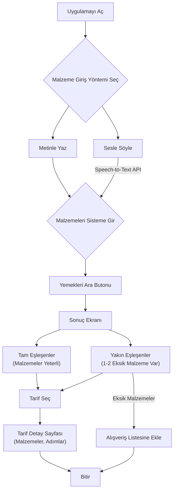

# "YemekbulAI" - Proje Tanım Dokümanı (PRD)

---

## 1. Özet

Bu proje, kullanıcıların evde bulunan malzemeleri belirterek bu malzemelerle yapabilecekleri yemek
tariflerini keşfetmelerini sağlayan bir mobil uygulamadır. Uygulama, "Elimdekilerle ne yapabilirim?"
sorusuna anında yanıt verirken, aynı zamanda küçük eklemelerle yapılabilecek alternatif yemekler
sunarak repertuvarı genişletmeyi hedefler. Temel amaç, günlük yemek yapma karar sürecini
basitleştirmek, gıda israfını azaltmak ve mutfakta yaratıcılığı teşvik etmektir.

---

## 2. Çözülen Problem

- **Karar Yorgunluğu:** Her gün "Bugün ne pişirsem?" sorusuna cevap aramanın yarattığı zihinsel yük.
- **Malzeme Kısıtlılığı:** Evdeki mevcut malzemelerle ne yapılabileceğinin bilinmemesi.
- **Tekrarlayan Menüler:** Sürekli aynı yemeklerin yapılması ve yeni tarif deneme cesaretinin
  olmaması.
- **Gıda İsrafı:** Evdeki malzemelerin bozulmadan, zamanında kullanılmaması.

---

## 3. Hedef Kitle

- **Birincil:** Her gün yemek pişiren aileler, ev bireyleri.
- **İkincil:** Yalnız yaşayanlar, öğrenciler, elindeki malzemeyi verimli kullanmak isteyen herkes.
- **Üçüncül:** Yemek yapmaya yeni başlayan ve pratik tarifler arayan kişiler.

---

## 4. Temel Özellikler (Features)

### Aşama 1: MVP (Minimum Uygulanabilir Ürün) ✅ TAMAMLANDI

- **Özellik 1: Malzeme Girişi** ✅
  - **Manuel Giriş:** Kullanıcıların evdeki malzemeleri yazarak veya listeden seçerek ekleyebileceği
    bir arayüz.
  - **Sesli Giriş:** Kullanıcının mikrofon tuşuna basarak malzemeleri sisteme dikte edebilmesi.
- **Özellik 2: Akıllı Tarif Önerme Motoru** ✅
  - **Tam Eşleşme ("Bunları Yapabilirsin"):** Sadece kullanıcının girdiği malzemelerle yapılabilecek
    yemek tariflerini listeleyen bir bölüm.
  - **Yakın Eşleşme ("Şunu Alırsan Bunları da Yapabilirsin"):** Mevcut malzemelere ek olarak 1 veya
    2 temel malzeme eklenerek yapılabilecek yemekleri öneren bir bölüm.
- **Özellik 3: Tarif Görüntüleme** ✅
  - Seçilen yemeğin malzemelerini ve adım adım hazırlanış talimatlarını gösteren basit ve okunaklı
    bir ekran.

### Aşama 2: Geliştirmeler (Harika Olur) 🔄 HAZIR

- **Özellik 4: Alışveriş Listesi Oluşturma** ✅
  - Eksik malzemeleri otomatik olarak bir alışveriş listesine ekleme butonu.
- **Özellik 5: Favori Tarifler** ⏳
  - Kullanıcıların beğendikleri tarifleri kaydedebilecekleri bir "Favorilerim" bölümü.
- **Özellik 6: Filtreleme ve Kategori** ⏳
  - Tarif sonuçlarını yemek türüne, hazırlık süresine göre filtreleme imkanı.

### Aşama 3: Gelecek Fikirleri (Vizyon) ⏳ PLANLANIYOR

- **Özellik 7: Haftalık Yemek Planlayıcı**
- **Özellik 8: Kullanıcıların Tarif Eklemesi**

---

## 5. Kullanıcı Akışı



---

## 6. Teknik Altyapı

### ✅ Tamamlanan Geliştirmeler

#### Frontend (React Native + Expo + TypeScript)

- **Ana Ekran (HomeScreen):** Malzeme girişi, sesli komut, malzeme listesi yönetimi
- **Sonuç Ekranı (RecipeResultsScreen):** Tam ve yakın eşleşmelerin listelenmesi
- **Tarif Detay Ekranı (RecipeDetailScreen):** Malzemeler, adımlar, sesli okuma, alışveriş listesi
- **Navigation:** Stack navigator ile ekranlar arası geçiş
- **TypeScript:** Tam tip güvenliği için tüm bileşenler TypeScript ile yazıldı

#### Backend (Supabase)

- **Veritabanı Tasarımı:** Tarifler ve malzemeler için PostgreSQL tabloları
- **API Servisleri:** Tarif arama, malzeme eşleştirme algoritmaları
- **Type Safety:** Supabase ile tam tip güvenliği

#### Özellikler

- **Sesli Komutlar:** Expo Speech entegrasyonu ile text-to-speech
- **Akıllı Arama:** Fuzzy matching ile malzeme eşleştirme
- **Responsive Design:** Tüm ekran boyutlarında uyumlu tasarım

### 🔄 Sonraki Adımlar

1. **Supabase Konfigürasyonu:** Gerçek veritabanı bağlantısı ve test verileri
2. **Tarif Veritabanı:** Türk yemekleri tarif setinin eklenmesi
3. **Speech-to-Text:** Gerçek sesli giriş API entegrasyonu
4. **Test:** Cihazda test ve performans optimizasyonu

---

## 7. Geliştirme Durumu

### ✅ Tamamlanan

- Proje altyapısı (Expo + TypeScript)
- Tüm ana ekranlar
- Navigation sistemi
- Supabase entegrasyonu hazır
- Responsive UI tasarımı
- Sesli okuma özelliği

### 🔄 Devam Eden

- Supabase veritabanı konfigürasyonu
- Test tarif verilerinin eklenmesi

### ⏳ Planlanan

- Production ortamına deploy
- App Store / Google Play yayını
- Kullanıcı geri bildirimleri
- İleri seviye özellikler

---

## 8. Başlatma Komutları

```bash
# Projeyi çalıştırma
cd yemek-bulucu
npm start

# iOS simülator
npm run ios

# Android emülatör
npm run android

# Web versiyonu
npm run web
```
